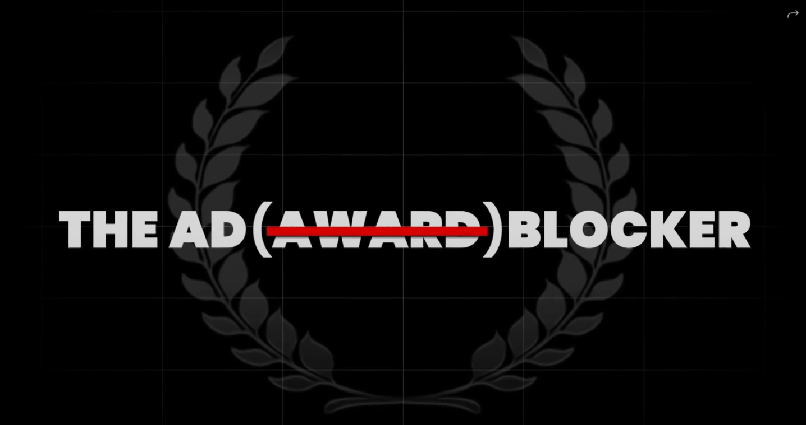

# 🧠 The Ad (Award) Blocker – LinkedIn Mental Health Extension  
### [🌐 Visit Official Website](https://theadawardblocker.com/)

## Watch the promo video by clicking on the image below

## 🏆 An Award-Winning Extension (Ironically)

**The Ad (Award) Blocker** is a Chrome extension built to bring peace of mind to creatives during award season — by hiding those overwhelming “I’m delighted to announce…” posts on LinkedIn.

This ironically award-winning tool was made with mental health in mind, offering a gentle, toggleable escape for advertising professionals facing **imposter syndrome** or **award FOMO**.

---

## 🚫 Why Block Award Posts?

LinkedIn becomes a minefield during award season.

- Some are celebrating well-earned victories 🏅  
- Others are just trying to survive the day, stuck on client revisions 🙃

Instead of logging off completely, **The Ad (Award) Blocker** lets you take control of your feed by hiding award-related content — no judgment, just peace ✌️

---

## 💡 How It Works

Using a blend of **AI**, **ML**, and a curated list of 10,000+ LinkedIn award posts:

- 🧠 It identifies award-related keywords like “delighted,” “honoured,” “humbled,” and “thrilled”
- ✨ It hides award announcements without disrupting your feed
- 🔁 Toggle the feature on/off anytime based on your mood or mindset

---

## 🔧 Features

- ✅ Toggle ON/OFF anytime  
- 🧠 AI/ML-powered keyword recognition  
- 👁️‍🗨️ Non-destructive: hides posts without deleting or modifying them  
- 🧩 Lightweight Chrome extension  
- 🔒 Privacy-focused — no personal data collected  

---

## 🛠️ Tech Stack

| Tech              | Role                                     |
|------------------|------------------------------------------|
| JavaScript        | Core logic, DOM manipulation             |
| Chrome Extension APIs | Feed interaction, toggling UI          |
| Machine Learning  | Trained on 10K+ award-related LinkedIn posts |
| HTML/CSS          | UI/UX design for toggle and popups       |

---

## 💬 Feedback from the Community

> “The *most* ironically needed Chrome extension in ad land.”  
> “Honestly made award season bearable.”  
> “This is the only award-winning product I don’t mind seeing on LinkedIn.”

---

## 🤝 Built For Creatives, By Creatives

We understand how tough the ad game can be — that's why this project is built with empathy, humor, and just enough sarcasm to keep it interesting. Whether you're thriving or surviving, **The Ad (Award) Blocker** has your back.

> Mental health matters.  
> LinkedIn doesn't have to be all awards, all the time.

---

## 📄 License

MIT License — free to use, fork, and modify.  
No awards required.

---

## 🌐 Visit the Site

📌 [theadawardblocker.com](https://theadawardblocker.com/)

---
